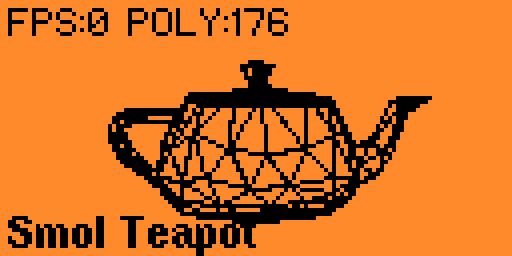

# Smol Teapot for Flipper Zero


## Overview

Smol Teapot is a 3D wireframe renderer for the Flipper Zero that displays the classic Utah Teapot model. This application demonstrates real-time 3D graphics capabilities on the Flipper Zero's 128x64 monochrome display.




## Features

- Real-time 3D wireframe rendering
- Manual rotation control using directional buttons
- Auto-rotation mode with multiple axis options
- FPS counter and polygon count display
- Backface culling for better performance
- Optimized for Flipper Zero's limited resources

## Controls

- **Up/Down**: Rotate around X axis
- **Left/Right**: Rotate around Y axis
- **OK (short press)**: 
  - In normal mode: Reset rotation to default position
  - In auto-rotation mode: Cycle through rotation axes (X, Y, Z)
- **OK (long press)**: Toggle auto-rotation mode
- **Back**: Exit application

## Technical Details

Smol Teapot implements:

- 3D matrix transformations
- Wireframe rendering using Bresenham's line algorithm
- Backface culling for performance optimization
- Double-buffered rendering to reduce flickering
- Efficient memory usage with custom render buffer

## Installation

1. Build the application using uFBT:
   ```
   ufbt
   ```

2. Install on your Flipper Zero:
   ```
   ufbt launch
   ```

## Development

This application demonstrates several interesting techniques:

- Efficient 3D math operations on resource-constrained hardware
- Memory-efficient rendering algorithms
- Input handling and user interface design
- Performance optimization techniques

## Credits

- Original Utah Teapot model by Martin Newell (1975)
- Implementation for Flipper Zero by Krzysztof Krystian Jankowski

## License

This project is licensed under the MIT License - see the [LICENSE](LICENSE) file for details.
